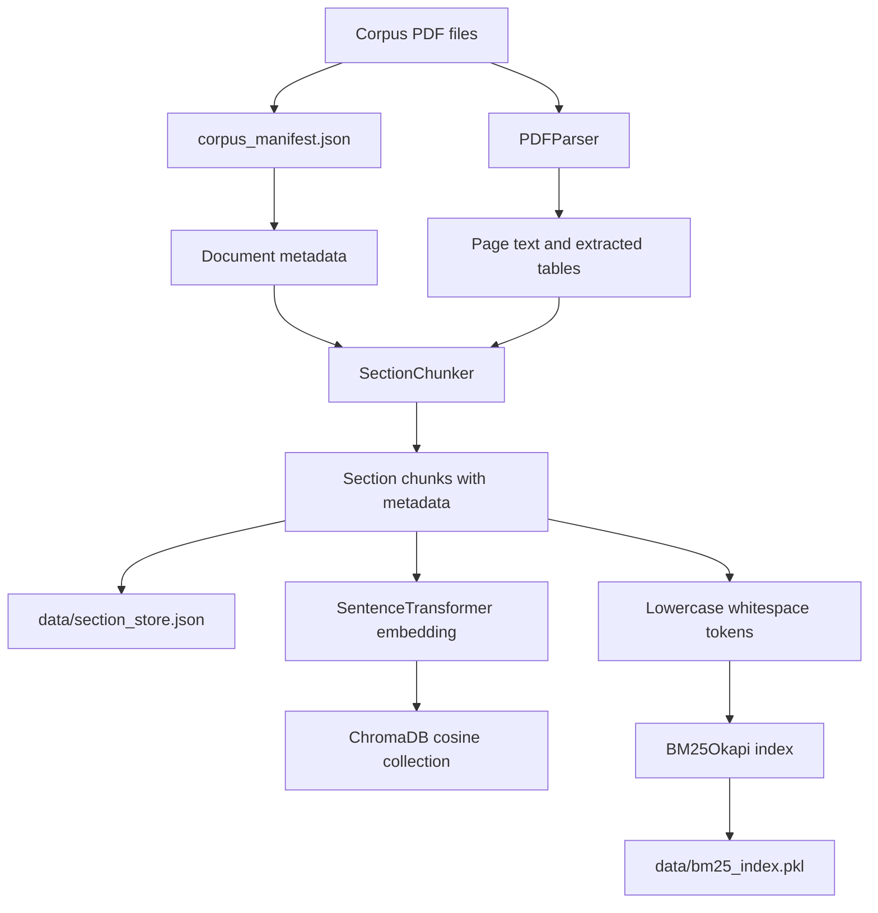
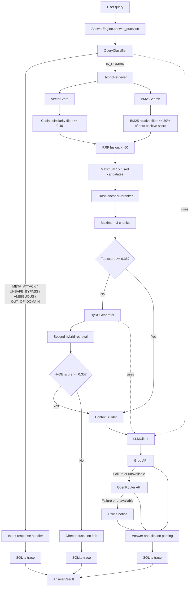

# Cerulean Systems Command-Line RAG AI Assistant

This project is a command-line Retrieval-Augmented Generation (RAG) AI assistant for answering questions about Cerulean Systems policies, products, pricing, HR, finance, procurement, security, and operations.

It is intentionally a CLI rather than a web chatbot. The command-line interface is the user-facing assistant, while the RAG pipeline performs document retrieval, reranking, grounding, safety routing, and answer generation.

The generation models are open-weight models accessed through hosted Groq and OpenRouter endpoints. This is allowed by the assignment requirement: the model must be open-weight, but it does not have to run locally. The embedding and reranker models run locally.

The system uses hybrid retrieval: semantic vector search and keyword search are combined with Reciprocal Rank Fusion (RRF), then reranked by a cross-encoder before the final answer is generated. Query traces, retrieval candidates, prompts, and errors are stored in SQLite for observability and evaluation.

## Features

- PDF ingestion with section-based chunking
- Table extraction and text extraction from PDF documents
- Dense retrieval with ChromaDB and sentence-transformer embeddings
- Sparse retrieval with BM25Okapi
- RRF hybrid result fusion
- Cross-encoder reranking
- HyDE fallback retrieval for low-confidence queries
- Query intent classification and safety routing
- Version-aware document metadata and supersession flags
- Inline document citations in generated answers
- Groq, OpenRouter, and offline model fallback
- SQLite prompt storage and execution tracing
- Deterministic evaluation checks for behavior, citations, numeric grounding, and canary leakage

## Architecture

### Offline ingestion



### Runtime query flow



## Query Processing

### 1. Intent classification

`QueryClassifier` makes one LLM classification call and returns one of:

- `IN_DOMAIN`
- `META_ATTACK`
- `UNSAFE_BYPASS`
- `AMBIGUOUS`
- `OUT_OF_DOMAIN`

Non-`IN_DOMAIN` queries do not enter retrieval. They are handled directly by `AnswerEngine` with a clarification, refusal, or safety response.

### 2. Dense cosine retrieval

`VectorStore` uses:

- Model: `BAAI/bge-small-en-v1.5`
- Storage: ChromaDB persistent collection `cerulean_sections`
- Distance: cosine
- Normalized embeddings: enabled
- Maximum requested results: `15`
- Minimum similarity: `COSINE_MIN_SCORE`, default `0.40`

Chroma returns cosine distance. The code converts it to similarity:

```python
similarity = 1.0 - distance
```

Chunks below `0.40` are discarded before hybrid fusion. The system may return fewer than 15 chunks.

The method accepts an optional Chroma `where` filter, but the current runtime path does not pass one. Therefore, document version, effective date, classification, and superseded status are metadata rather than active retrieval filters.

### 3. BM25 retrieval

`BM25Search` uses:

- Algorithm: `BM25Okapi`
- Index: `data/bm25_index.pkl`
- Query tokenization: lowercase followed by whitespace splitting
- Maximum results considered: `15`
- Minimum relative score: `BM25_MIN_RELATIVE_SCORE`, default `0.30`

BM25 scores the indexed corpus, sorts scores from highest to lowest, and first keeps at most 15 results. It then calculates:

```text
minimum_score = best_positive_score * 0.30
```

Only results at or above that value continue. If the best score is zero or negative, BM25 returns no chunks.

BM25 scores are not percentages and are not compared directly with cosine scores.

### 4. Reciprocal Rank Fusion

The filtered dense and sparse lists are merged by `chunk_id`. A chunk appearing in both lists receives contributions from both rankings:

```text
RRF score = 1 / (RRF_K + rank)
```

Current configuration:

- `RRF_K = 60`
- Maximum fused candidates: `15`

RRF uses ranks, not raw cosine or BM25 score values. Duplicate chunk IDs are removed during fusion.

### 5. Cross-encoder reranking

The fused candidates are scored using the local cross-encoder model:

```text
BAAI/bge-reranker-base
```

The raw score is converted with sigmoid normalization:

```python
probability = 1 / (1 + exp(-raw_score))
```

The results are sorted by this normalized score. `RERANK_TOP_K = 3` means **up to three chunks**, not always exactly three:

| Available candidates | Returned chunks |
|---:|---:|
| 0 | 0 |
| 1 | 1 |
| 2 | 2 |
| 3 or more | 3 |

Only these final chunks are sent to context assembly and answer generation.

### 6. Confidence and HyDE fallback

The highest reranker score is checked against:

```text
CONFIDENCE_THRESHOLD = 0.35
```

When the score is below `0.35`, `HyDEGenerator` creates a hypothetical policy passage using the fast LLM path. The passage is sent through the same cosine, BM25, RRF, and reranking pipeline. If the HyDE result scores higher, it replaces the first-pass result.

If the HyDE score also remains below the confidence threshold, the system returns a "no information" response directly without making an LLM generation call. The response is: "The provided Cerulean Systems documentation does not contain enough information to answer this question."

## LLM Models and Fallbacks

### Groq primary provider

- General generation model: `openai/gpt-oss-120b`
- Fast model for classifier and HyDE: `openai/gpt-oss-20b`
- Client timeout: 60 seconds
- Maximum retries: 1

The `generate_fast()` method selects the fast Groq model and limits output to 400 tokens. Normal generation allows up to 1,500 tokens.

### OpenRouter fallback

If Groq is unavailable, has no configured key, or the Groq request fails, `LLMClient` tries OpenRouter.

- Endpoint: `https://openrouter.ai/api/v1/chat/completions`
- Default model: `minimax/minimax-m3:free`
- Timeout: 90 seconds
- Reasoning is enabled when the model name contains `minimax`

### Offline fallback

If both providers are unavailable, `_offline_context_summary()` returns a notice explaining that the Groq key is not configured. This is an operational fallback notice, not a generated grounded answer.

Required environment variables are loaded from `.env`:

```dotenv
GROQ_API_KEY=your_groq_api_key
OPENROUTER_API_KEY=your_openrouter_api_key
GROQ_GENERATION_MODEL=openai/gpt-oss-120b
GROQ_FAST_MODEL=openai/gpt-oss-20b
OPENROUTER_MODEL=minimax/minimax-m3:free
COSINE_MIN_SCORE=0.40
BM25_MIN_RELATIVE_SCORE=0.30
MAX_SECTION_TOKENS=2000
```

Never commit `.env` or expose API keys. Use `.env.example` as the template.

## Ingestion Details

The ingestion pipeline performs these steps:

1. Initialize the SQLite observability database.
2. Load `corpus/corpus_manifest.json`.
3. Resolve document supersession using effective dates and `BASELINE_DATE`.
4. Parse each manifest PDF with `pdfplumber`.
5. Fall back to `pypdf` if the primary parser fails.
6. Split text into numbered sections.
7. Split large sections at block or paragraph boundaries.
8. Add document, version, effective-date, and classification headers.
9. Save chunks to `data/section_store.json`.
10. Build the ChromaDB vector index.
11. Build the BM25 pickle index.

The configured section limit is `MAX_SECTION_TOKENS = 2000`. Token counting uses `tiktoken` with the `cl100k_base` encoding when available, with a word-based approximation as fallback.

## Project Structure

```text
src/
	config.py                    Central configuration and thresholds
	ingestion/
		pdf_parser.py              PDF text and table extraction
		manifest_loader.py          Manifest loading and supersession logic
		chunker.py                 Section chunk creation
		pipeline.py                End-to-end index building
	retrieval/
		vector_store.py            ChromaDB dense retrieval
		bm25_search.py             BM25 sparse retrieval
		hybrid_retriever.py        RRF fusion and retrieval orchestration
		reranker.py                Cross-encoder reranking
	generation/
		query_classifier.py        Query intent classification
		hyde.py                    HyDE fallback generation
		context_builder.py         Context and citation metadata assembly
		llm_client.py              Provider calls and fallbacks
		answer_engine.py            End-to-end answer orchestration
	observability/
		db.py                      SQLite schema and default prompts
		prompt_store.py            Versioned prompt access
		tracer.py                  Query, retrieval, and error logging
scripts/
	run_ingest.py                Initialize database and ingest corpus
	query.py                     Interactive or command-line querying
eval/
	run_eval.py                  Run the golden benchmark
	score_eval.py                Score benchmark outputs
```

## Installation

Use Python 3.10 or newer. Create and activate a virtual environment:

```powershell
python -m venv .venv
.\.venv\Scripts\Activate.ps1
python -m pip install --upgrade pip
python -m pip install -r requirements.txt
```

The ingestion parser requires `pdfplumber` and `pypdf`. The retrieval stack requires ChromaDB, `sentence-transformers`, `rank-bm25`, and `tiktoken`.

## Running the System

### Build or rebuild indexes

```powershell
python scripts/run_ingest.py
```

This creates or updates:

```text
data/section_store.json
data/bm25_index.pkl
data/chroma_db/
data/rag_trace.db
```

### Ask a question

Interactive mode:

```powershell
python scripts/query.py
```

Command-line mode:

```powershell
python scripts/query.py "What is the annual leave policy?"
```

## Evaluation

Run the benchmark:

```powershell
python eval/run_eval.py
python eval/score_eval.py
```

The evaluation checks:

- Expected behavior route
- Citation existence and grounding
- Numeric grounding against retrieved context
- System canary leakage
- Retrieval recall, MRR, and precision

Raw outputs are written to `eval/results/raw_outputs.json`, and the formatted report is written to `eval/RESULTS.md`.

## Configuration Reference

| Setting | Default | Purpose |
|---|---:|---|
| `BASELINE_DATE` | `2026-08-27` | Date used for document currency and supersession |
| `COSINE_MIN_SCORE` | `0.40` | Minimum dense similarity |
| `BM25_MIN_RELATIVE_SCORE` | `0.30` | Fraction of best positive BM25 score |
| `RRF_K` | `60` | RRF rank constant |
| `RETRIEVAL_TOP_K` | `15` | Maximum results/candidates per retrieval stage |
| `RERANK_TOP_K` | `3` | Maximum chunks returned after reranking |
| `CONFIDENCE_THRESHOLD` | `0.35` | Score below which HyDE is triggered |
| `MAX_SECTION_TOKENS` | `2000` | Section chunking target limit |
| `MIN_SECTION_TOKENS` | `50` | Reserved minimum-section setting |

## Security Notes

- Keep API keys in `.env`; never commit them.
- Retrieved PDF text is reference data and must not be treated as instructions.
- The system classifier routes meta-prompt and unsafe bypass requests before retrieval.
- The system prompt includes a canary token to detect prompt leakage.
- SQLite traces may contain user queries and assembled prompts; protect `data/rag_trace.db` accordingly.

## Current Limitations


## Fresh-Machine Runbook

These instructions assume Windows PowerShell, because that is the environment used for the recorded run. Linux and macOS users can replace the activation command with the equivalent shell command.

### Prerequisites

- Python 3.10 or newer. The recorded run used Python 3.11.16.
- Internet access for Python packages, Hugging Face model downloads, and the hosted LLM provider.
- At least 8 GB RAM is recommended. The recorded machine had an AMD Ryzen 5 3550H, 5.9 GB RAM, an NVIDIA GeForce GTX 1650, and AMD Radeon Vega 8 graphics.
- The corpus PDFs must be present under `corpus/` and referenced by `corpus/corpus_manifest.json`.

### Install

From the repository root:

```powershell
python -m venv .venv
.\.venv\Scripts\Activate.ps1
python -m pip install --upgrade pip
python -m pip install -r requirements.txt
```

Install the dependencies from the submitted `requirements.txt` file. It contains the package set required by the application, including the PDF parser, retrieval stack, local embedding and reranker models, hosted LLM client, and evaluation tools.

If PowerShell blocks activation, run this once in the current PowerShell session:

```powershell
Set-ExecutionPolicy -Scope Process -ExecutionPolicy Bypass
```

### Configure the hosted open-weight model

This implementation uses hosted endpoints serving open-weight models. It does not require Ollama, vLLM, or a local generation-model download. There is deliberately no `ollama pull` command: the generation models are accessed through the hosted endpoints described below.

Create `.env` in the repository root. At minimum, configure one provider:

```dotenv
GROQ_API_KEY=your_groq_api_key_here
GROQ_GENERATION_MODEL=openai/gpt-oss-120b
GROQ_FAST_MODEL=openai/gpt-oss-20b
```

Optional OpenRouter fallback:

```dotenv
OPENROUTER_API_KEY=your_openrouter_api_key_here
OPENROUTER_MODEL=minimax/minimax-m3:free
```

The model names above are open-weight models served through hosted APIs. The code tries Groq first, OpenRouter second, and an offline notice last. Never commit `.env` or paste a real API key into documentation.

### Download the local retrieval models

The generation models are hosted, but retrieval uses two open models downloaded and executed locally through `sentence-transformers`:

- Embedding model: `BAAI/bge-small-en-v1.5`
- Reranker model: `BAAI/bge-reranker-base`

The application downloads these models automatically the first time they are needed. To download them before running ingestion, use the activated virtual environment:

```powershell
python -c "from sentence_transformers import SentenceTransformer; SentenceTransformer('BAAI/bge-small-en-v1.5')"
python -c "from sentence_transformers import CrossEncoder; CrossEncoder('BAAI/bge-reranker-base')"
```

The models are cached locally by Hugging Face, so later runs reuse the cache. Internet access is required for the first download. The embedding model is loaded during ingestion and query-time vector search; the reranker is loaded when the query pipeline starts. These are retrieval models, not chat-generation models, so no `ollama pull` command is needed. The reranker scores query-chunk relevance; it does not follow chat prompts or generate answers.

### Build the indexes

Initialize SQLite and ingest the corpus:

```powershell
python scripts/run_ingest.py
```

The command parses the manifest PDFs, creates section chunks, embeds them, and writes:

```text
data/section_store.json
data/bm25_index.pkl
data/chroma_db/
data/rag_trace.db
```

The first ingestion can take substantially longer because the embedding model may need to download from Hugging Face. The reranker model is loaded when the query pipeline starts, not during ingestion. Ingestion timing was not formally measured for this run, so no precise duration is claimed here.

### Ask a question

Interactive mode:

```powershell
python scripts/query.py
```

Command-line mode:

```powershell
python scripts/query.py "What is the annual leave policy?"
```

In an informal local run on the hardware above, a typical query took approximately 5 seconds. This was not a controlled benchmark; actual time depends on model-cache state, provider latency, query complexity, and whether HyDE is triggered.

## Technology Choices and Assumptions

- **Python:** keeps ingestion, retrieval, generation, and evaluation in one small codebase.
- **pdfplumber with pypdf fallback:** extracts page text and attempts to preserve tables in Markdown. `pypdf` provides a simpler recovery path when the primary parser cannot process a file.
- **Sentence Transformers:** creates semantic embeddings using `BAAI/bge-small-en-v1.5`, a compact embedding model suitable for a small corpus.
- **ChromaDB:** provides persistent local vector search with cosine distance and avoids operating a separate database service.
- **BM25Okapi:** adds exact keyword retrieval, which helps with policy IDs, amounts, names, and technical limits.
- **Reciprocal Rank Fusion:** combines dense and sparse rankings without pretending their raw scores have the same scale.
- **Cross-encoder reranking:** compares the complete query with each candidate passage before generation.
- **Groq and OpenRouter:** provide hosted access to open-weight generation models without requiring commercial model ownership or local GPU generation.
- **SQLite:** gives a dependency-light audit trail for prompts, retrieval candidates, answers, and errors.

Key assumptions:

- The manifest is the source of truth for document IDs, versions, dates, and supersession.
- ISO-formatted effective dates are used for temporal comparisons.
- The corpus is small enough for a local BM25 index and local Chroma persistence.
- Retrieved document text is untrusted reference data and must never override system instructions.
- Three final passages are enough for the generation context for this benchmark.

## Five Main Weaknesses Before Production

1. **Accuracy is prioritized over latency.** The system intentionally performs query classification, hybrid retrieval, cross-encoder reranking, and sometimes a HyDE second pass before final generation. This makes the answer more reliable and grounded, but the recorded query latency was approximately 3 to 56 seconds. I chose answer reliability over making the system as fast as possible. Before production, I would preserve the quality gates while adding caching, model warm-up, parallel provider calls where safe, and a bounded end-to-end timeout.

2. **Classifier failure trades availability for safety.** If classification fails or returns invalid JSON, deterministic safeguards identify obvious meta or unsafe requests; unknown cases now fail closed as `OUT_OF_DOMAIN` instead of entering retrieval. This prevents unsafe input from reaching generation, but a temporary provider failure can also block a valid company-policy question. Before production, I would add a separately tested local classifier or ruleset and monitor false refusals.

3. **Date and version reasoning is delegated to the final LLM.** The retrievers return chunks without deciding which document version is authoritative; the final LLM receives effective dates, versions, and superseded status and is instructed to resolve current-versus-historical questions. This keeps retrieval broad enough to expose conflicts, but it leaves an important decision to model reasoning. I would add deterministic date/version selection before generation and require the LLM to explain the selected source.

4. **The generation layer depends on hosted APIs.** Groq is the primary provider and OpenRouter is the fallback, so network outages, rate limits, provider downtime, API changes, or model availability can prevent classification, HyDE generation, or final answer generation. This is an intentional choice to use hosted open-weight models without requiring a local generation GPU. Before production, I would add provider health checks, circuit breakers, request budgets, explicit provider version pinning, structured retry handling, and a tested local open-weight model fallback.

5. **Answer and citation validation is too permissive.** The model response is parsed with broad exception handling, citations are extracted with a regex, and missing citations fall back to retrieved documents. This can make a weak answer appear grounded. I would use a strict structured output schema, validate every citation against the exact retrieved chunks, and reject unsupported factual claims.

## Deliberate Omissions

- **No web search:** the assistant is intentionally restricted to the supplied company corpus so answers remain auditable.
- **No user accounts or authorization layer:** this is an evaluation CLI, not a multi-user enterprise service. Production deployment would need identity, document-level access control, and tenant isolation.
- **No streaming UI or web application:** the assignment evaluates retrieval and answer behavior; a CLI keeps the implementation surface small.
- **No local generation model:** hosted open-weight endpoints avoid requiring every evaluator to download and run a large generation model. The embedding and reranker models are still downloaded locally.
- **No automatic corpus watcher:** ingestion is an explicit command so index changes are deliberate and reproducible.
- **No conversation memory:** each query is independent, which reduces accidental leakage between users and keeps evaluation deterministic.

## Enterprise Deployment Concern

The first concern would be authorization and data governance, not retrieval quality. The current system stores assembled prompts, user queries, retrieved text, and model responses in a local SQLite trace database, while the generation request may be sent to an external hosted provider. Before real users see it, I would need approved data handling, document-level access controls, retention and redaction rules, provider contracts, and an auditable deployment identity model.
